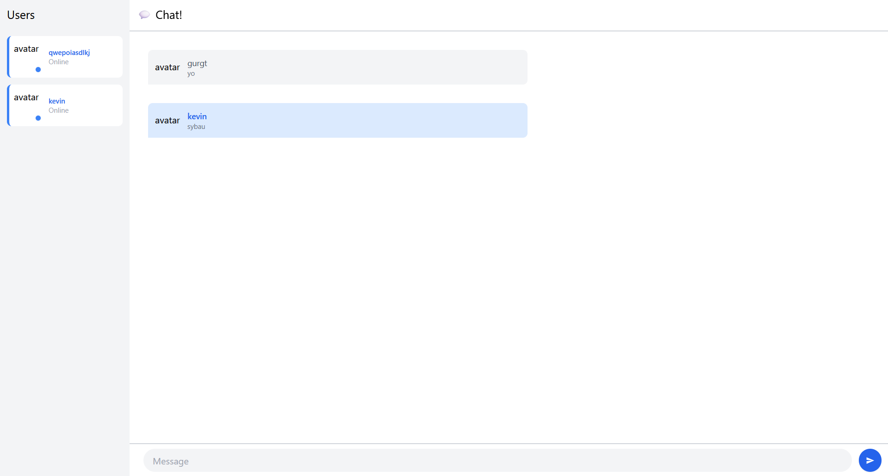

# YewChat 
## Experiment 3.1: Original code

Pada eksperimen ini, saya menjalankan SimpleWebSocketServer terlebih dahulu sebagai server WebSocket. Setelah server berjalan, saya menjalankan aplikasi YewChat. Terlihat bahwa aplikasi berhasil terhubung ke server dan memungkinkan komunikasi chat secara real-time antar client.

